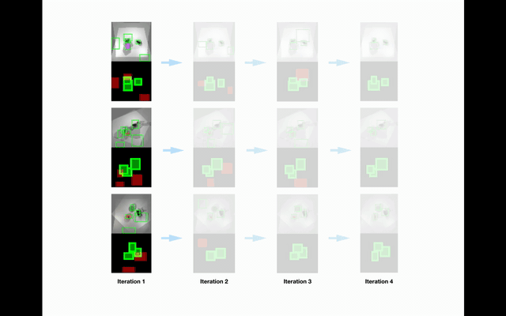

# gastronomy/perception

This repository contains the code release for: **3D Object Recognition By Corresponding and QuantizingNeural 3D Scene Representations**.

## pytorch_disco
This repository contains the code for all our models. 

### Installation
First you have to make sure that you have all dependencies in place. The simplest way to do so, is to use anaconda.
`conda env create -f environment.yaml`
`conda activate pdisco`

### Dataset ###
#### Use pre rendered dataset ####
We strongly recommend to use the pre-rendered dataset. This dataset can be donwloaded from [here](https://drive.google.com/file/d/14danQIUYmZ-R3Gy3rRe9xiuAVDbgoEqD/view?usp=sharing). It is around 20GBs. Download and extract it in ``pytorch_disco`` repository. 
#### Generate your own clevr veggie dataset ####

CLEVR Dataset Generation:

To generate your own dataset, checkout the `3dblender` repository and follow the following steps:

1. Download [blender 2.79b](https://www.blender.org/download/releases/2-79/)
2. Follow Step 1 of this wiki: [https://github.com/facebookresearch/clevr-dataset-gen](https://github.com/facebookresearch/clevr-dataset-gen)
3. Download some obj mesh files and place them in `3dblender/data/shapes` directory. There are some vegetable meshes already there.
4. The script provides multiple argumetents for configuring data generation. These arguments can be seen in render_images.py file.
5. Sample data generation command:
`blender --background --python render_images.py – --num_images 1000 --use_gpu 1 --height 256 --width 256 --dataset_name CLEVR_TEST --do_random_rotation 1 --min_objects 1 --max_objects 3`
This command will generate multiview scenes with 1-3 objects in each scene. Each object will be subjected to random rotation.
6. Now execute `python setup/write_npy_clevr_veggies.py <mod_name> CLEVR_TEST <path_to_CLEVR_TEST> <destination_path>` from inside the pytorch_disco directory.
``mod_name``refers to the folder name which will be created to save pickle files generated by above script. ``destination_path`` is the path where you want to save those pickle files. The directory structure will be ``<destination_path>/npys/<mod_name>``
7. Change the ``trainset`` and ``testset`` for ``clevr_veggies_test_sta_multiple_rotate`` and ``clevr_veggies_test_sta_multiple_rotate_test`` groups in ``exp_clevr_sta.py`` file accordingly.

### Training ###

Checkpoints will be saved in ``pytorch_disco/checkpoints`` directory. Tensorboard logs will be saved in ``logs_clevr_sta`` for steps 1, 3, 4 and in ``logs_nel_sta`` for step 2.
Any checkpoint model that you want to be loaded should be placed at the end in pretrained_nets_carla.py file.

1. View prediction and occupancy prediction pretraining: ``python main.py cs --en clevr_multiview_training --rn <ANY_RUN_NAME>``. Add the checkpoint name at the end of pretrained_nets_carla.py for next stage of training.
2. Hard positive mining training: ``python main.py nel --en clevr_multiple_trainer_hard_exp5_pret_moc_orient --rn <ANY_RUN_NAME>``. Add the checkpoint name at the end of pretrained_nets_carla.py for next stage of training.
3. Clustering training:
``python main.py cs --en clevr_trainer_gen_examples_multiple --rn <run_name>`` to
initialize the clusters. Then run this for cluster training: ``python main.py cs --en clevr_trainer_quantize_object_no_detach_rotate_50_init_examples_hard_only_embed_frozen --rn <run_name>`` Add the checkpoint name at the end of pretrained_nets_carla.py for next stage of training.
4. Self improving detector training:
``python main.py cs --en det_trainer_big_freeze_vq_rotate_selfimproveIterate_deep_multiple_maskout_hardneg --rn <run_name>``

